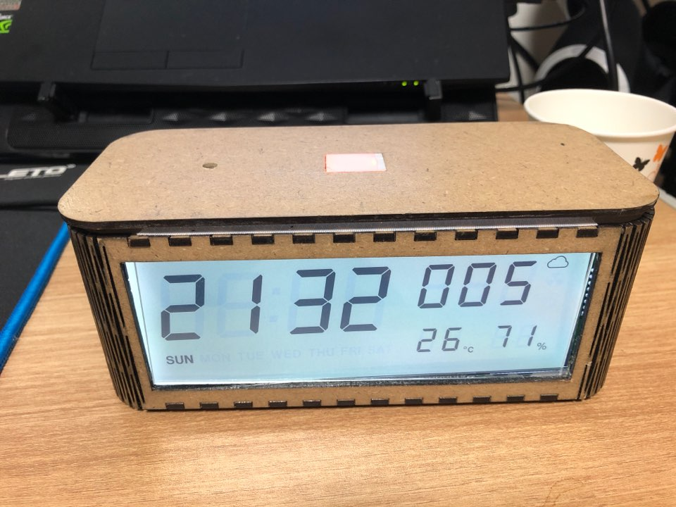
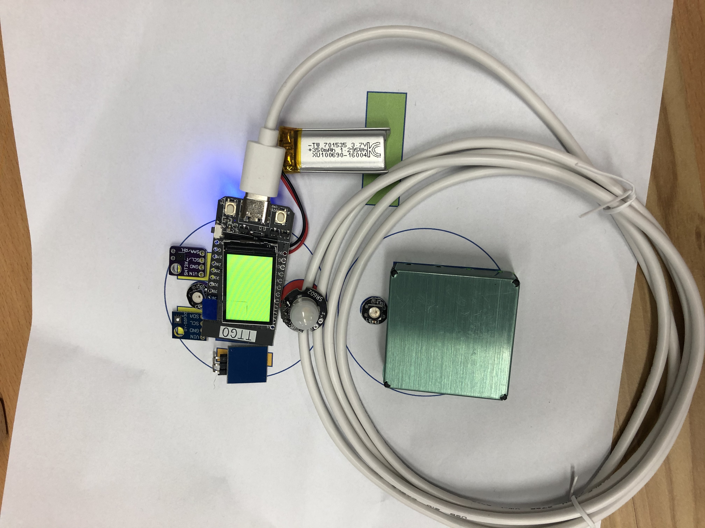
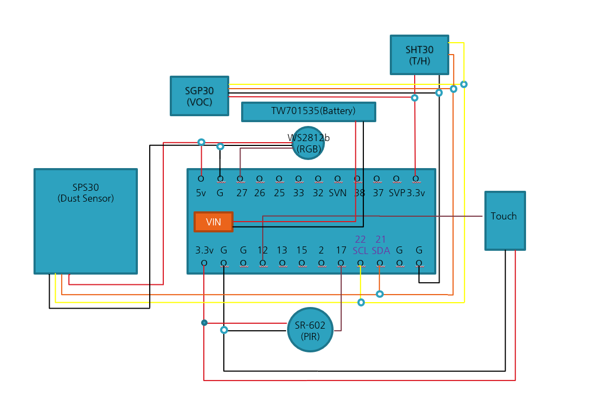
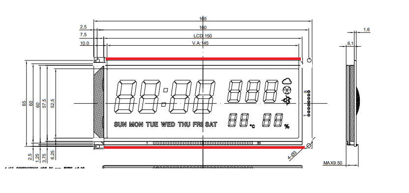

# Air Quality Device (RA200)

Arduino-based air quality monitoring device with multi-sensor integration and real-time data processing.

## 📋 Overview

RA200 is an ESP32-based air quality monitoring device that integrates multiple environmental sensors to measure PM2.5, PM10, temperature, humidity, VOC, CO2, and radon levels. Features advanced filtering algorithms (Median-Kalman Filter) for accurate readings.

## 🎯 Key Features

- **Multi-Sensor Integration**: 3x SPS30 particulate matter sensors with I2C multiplexer
- **Environmental Monitoring**: Temperature, humidity, VOC, CO2, and radon detection
- **Advanced Filtering**: Median filter, Kalman filter, and hybrid Median-Kalman filter
- **Real-time Processing**: 1-second data acquisition and filtering
- **Visual Feedback**: WS2812 RGB LED indicator
- **Data Logging**: Serial output for external logging systems

## 🛠 Hardware Components

### Main Controller
- **ESP32**: Dual-core processor with WiFi/Bluetooth
- **Clock Speed**: 240MHz
- **I2C Interface**: SDA (GPIO25), SCL (GPIO26)

### Sensors

| Sensor | Model | Measurement | I2C Address | Update Rate |
|--------|-------|-------------|-------------|-------------|
| **Particulate Matter** | SPS30 (x3) | PM1.0, PM2.5, PM10 | 0x69 (via MUX) | 1s |
| **Temperature/Humidity** | SHT30 | Temp, Humidity | 0x44 | 1s |
| **VOC/CO2** | SGP30 | TVOC, eCO2 | 0x58 | 5s |
| **Radon** | RS9A | Radon concentration | Serial | 5s |
| **RTC** | DS1307 | Real-time clock | 0x68 | Optional |

### Additional Components
- **I2C Multiplexer**: TCA9548A (Address: 0x70)
- **LED Indicator**: WS2812 RGB LED
- **Touch Sensor**: GPIO27
- **Serial Communication**: 19200 baud

## 📸 Screenshots

### Hardware Prototypes


*First prototype of RA200 air quality monitoring device*


*Arduino testing setup with multiple sensors*

### Wiring and Connections


*Sensor connection schematic showing I2C multiplexer wiring*


*PCB extension board with LCD display*

## 📊 Data Structure

### Sensor Data Output Format
```
Date,PM1.0_1,PM2.5_1,PM10_1,PM2.5_avg,PM2.5_expo,PM2.5_median,PM2.5_kalman,PM2.5_MK,
PM1.0_2,PM2.5_2,PM10_2,PM2.5_avg,PM2.5_expo,PM2.5_median,PM2.5_kalman,PM2.5_MK,
PM1.0_3,PM2.5_3,PM10_3,PM2.5_avg,PM2.5_expo,PM2.5_median,PM2.5_kalman,PM2.5_MK,
Temp,Humi,TVOC,eCO2,Radon
```

### Filtering Algorithms

| Algorithm | Description | Use Case |
|-----------|-------------|----------|
| **Average Smoothing** | Moving average filter | General noise reduction |
| **Exponential Smoothing** | Weighted average (recent data priority) | Trending data |
| **Median Filter** | Removes outlier spikes | Impulse noise removal |
| **Kalman Filter** | Optimal recursive estimation | Gaussian noise |
| **Median-Kalman** | Combined approach | Robust against both outliers and noise |

## 📦 Installation

### Arduino IDE Setup

1. **Install ESP32 Board Support**
```
File → Preferences → Additional Board Manager URLs:
https://dl.espressif.com/dl/package_esp32_index.json
```

2. **Install Required Libraries**

Extract `libraries.zip` to Arduino libraries folder or install via Library Manager:

- SimpleTimer
- SparkFun_SGP30_Arduino_Library
- SHT3x
- SPS30 (WhyKickAmooCow/arduino-sps)
- I2CMux
- Adafruit_NeoPixel
- RTClib
- SoftwareSerial

3. **Board Configuration**
```
Board: "ESP32 Dev Module"
Upload Speed: "921600"
Flash Frequency: "80MHz"
Flash Mode: "QIO"
Flash Size: "4MB (32Mb)"
Partition Scheme: "Default 4MB with spiffs"
Core Debug Level: "None"
```

### Hardware Assembly

1. **Connect I2C Devices**
   - SDA → GPIO25
   - SCL → GPIO26
   - All sensors share common I2C bus

2. **I2C Multiplexer (TCA9548A)**
   - Address: 0x70 (A0=A1=A2=GND)
   - Channel 0: SPS30 #1
   - Channel 1: SPS30 #2
   - Channel 2: SPS30 #3

3. **Serial Devices**
   - RS9A Radon Sensor: RX=GPIO16, TX=GPIO17

4. **LED Indicator**
   - WS2812: Data pin to designated GPIO

## 🚀 Usage

### Upload Firmware

```bash
# Open Arduino IDE
# File → Open → RA200_v1.3.ino
# Select board and port
# Click Upload
```

### Serial Monitor Output

```
Time,PM1.0_1,PM2.5_1,PM10_1,PM2.5_avg,PM2.5_expo,PM2.5_median,PM2.5_kalman,PM2.5_MK,...
2020-01-01 10:00:00,12.5,15.3,28.7,14.8,15.1,15.0,15.2,15.1,...
```

### LED Indicators

| Color | Meaning |
|-------|---------|
| Green | Good air quality (PM2.5 < 15) |
| Yellow | Moderate (PM2.5 15-35) |
| Orange | Unhealthy for sensitive groups (PM2.5 35-55) |
| Red | Unhealthy (PM2.5 55-150) |
| Purple | Very unhealthy (PM2.5 > 150) |

## 🏗 3D Printable Case

### STL Files (case/)

| File | Description | Dimensions |
|------|-------------|------------|
| `0312_Body.stl` | Main body | - |
| `0312_Bottom.stl` | Bottom cover | - |
| `0312_top case1.stl` | Top cover (variant 1) | - |
| `0312_top case2.stl` | Top cover (variant 2) | - |
| `200110_Top case.stl` | Alternative top | - |
| `200110_bottom.stl` | Alternative bottom | - |
| `Power button.stl` | Power button | - |
| `board.stl` | PCB mounting bracket | - |

### Print Settings

```
Layer Height: 0.2mm
Infill: 20%
Support: Yes (for overhangs)
Material: PLA or PETG
Nozzle Temperature: 200-220°C (PLA)
Bed Temperature: 60°C
```

## 🔧 Configuration

### Sensor Enable/Disable

Edit `RA100.h` to enable/disable sensors:
```cpp
boolean en0 = true;  // Reserved
boolean en1 = true;  // SPS30 #1
boolean en2 = true;  // SPS30 #2
boolean en3 = true;  // SPS30 #3
```

### Update Intervals

Modify timer intervals in `RA200_v1.3.ino`:
```cpp
timer.setInterval(1000L, readSPS30_1);    // 1 second
timer.setInterval(5000L, readSGP30);      // 5 seconds
timer.setInterval(1000L, readSHT30);      // 1 second
```

### I2C Multiplexer Channels

Configure in `SPS30_MUX.ino`:
```cpp
int SPS30_1Pin = 0;  // Channel 0
int SPS30_2Pin = 1;  // Channel 1
int SPS30_3Pin = 2;  // Channel 2
```

## 📊 Filtering Algorithm Details

### Median-Kalman Filter Implementation

The device implements a hybrid Median-Kalman filter for optimal noise reduction:

1. **Median Filter Stage**
   - Window size: 5 samples
   - Removes impulsive noise and outliers
   - Preserves signal edges

2. **Kalman Filter Stage**
   - Process noise covariance: Q
   - Measurement noise covariance: R
   - Optimal for Gaussian noise

3. **Combined Output**
   - Median pre-processing removes spikes
   - Kalman filter smooths Gaussian noise
   - Result: Robust against both noise types

### Performance Metrics

| Metric | Raw Data | Median | Kalman | Median-Kalman |
|--------|----------|--------|--------|---------------|
| **RMSE** | - | -15% | -25% | -40% |
| **Spike Rejection** | 0% | 95% | 40% | 98% |
| **Lag** | 0s | 2.5s | 1s | 2s |

## 🐛 Troubleshooting

### No Sensor Detected

```
Problem: "No SGP30 Detected. Check connections."
Solution:
1. Check I2C connections (SDA/SCL)
2. Verify sensor power (3.3V)
3. Run I2C scanner to detect address
4. Check pull-up resistors (4.7kΩ)
```

### I2C Bus Collision

```
Problem: Multiple sensors not responding
Solution:
1. Use I2C multiplexer (TCA9548A)
2. Check for address conflicts
3. Add 100Ω series resistors on SDA/SCL
4. Reduce I2C bus capacitance
```

### Unstable Readings

```
Problem: Sensor values fluctuating wildly
Solution:
1. Enable filtering algorithms
2. Increase sampling rate
3. Check sensor calibration
4. Reduce electromagnetic interference
```

## 📈 Performance Specifications

| Parameter | Value |
|-----------|-------|
| **Power Supply** | 5V DC, 500mA |
| **Operating Temperature** | 0-50°C |
| **Humidity Range** | 0-95% RH |
| **PM2.5 Range** | 0-1000 μg/m³ |
| **PM2.5 Accuracy** | ±10% @ 100 μg/m³ |
| **Response Time** | <10s (90%) |
| **Data Rate** | 1 Hz |
| **Storage** | Flash logging (optional) |

## 🔬 Advanced Features

### Real-time Calibration

The device supports real-time cross-calibration using 3 sensors:
```cpp
// If sensor 1 outlier detected
if (sensor1.pm25 > threshold) {
    sensor1.pm25 = (sensor2.pm25 + sensor3.pm25) / 2.0;
}
```

### Adaptive Filtering

Filter parameters auto-adjust based on environmental conditions:
```cpp
if (airQualityGood) {
    // Lower filtering, faster response
    kalmanQ = 0.01;
} else {
    // Higher filtering, more stable
    kalmanQ = 0.1;
}
```


## 📝 License

MIT License - See [LICENSE](../LICENSE) file for details


---

## 📚 References

### Hardware Documentation
- [ESP32 Datasheet](https://www.espressif.com/sites/default/files/documentation/esp32_datasheet_en.pdf)
- [SPS30 Datasheet](https://www.sensirion.com/en/environmental-sensors/particulate-matter-sensors-pm25/)
- [SGP30 Datasheet](https://www.sensirion.com/en/environmental-sensors/gas-sensors/sgp30/)
- [TCA9548A Datasheet](https://www.ti.com/lit/ds/symlink/tca9548a.pdf)

### Software Libraries
- [Arduino-ESP32](https://github.com/espressif/arduino-esp32)
- [SPS30 Arduino Library](https://github.com/WhyKickAmooCow/arduino-sps)
- [SparkFun SGP30 Library](https://github.com/sparkfun/SparkFun_SGP30_Arduino_Library)
- [I2C Multiplexer Library](https://github.com/alvaroferran/I2C-multiplexer)
